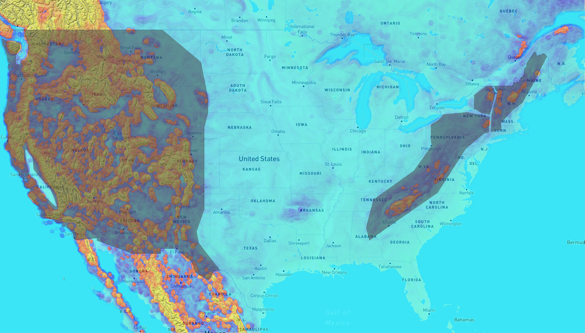
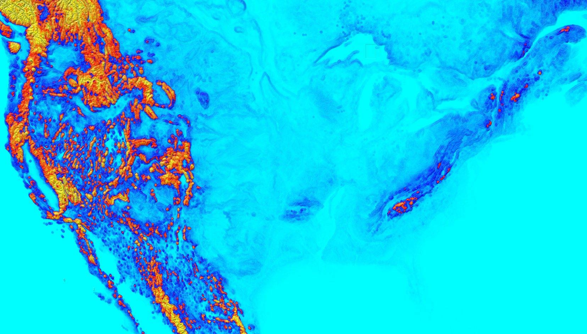
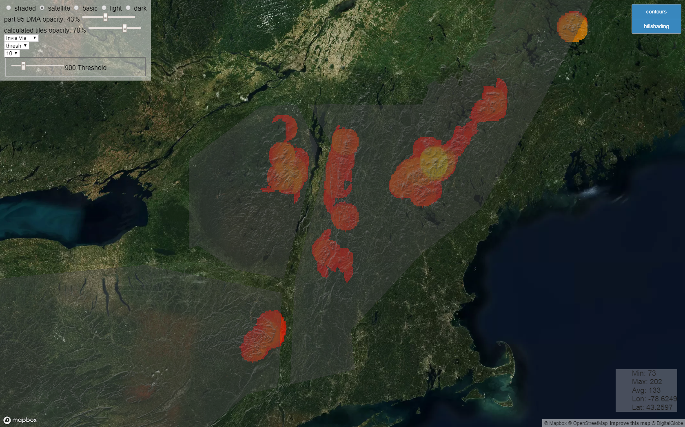
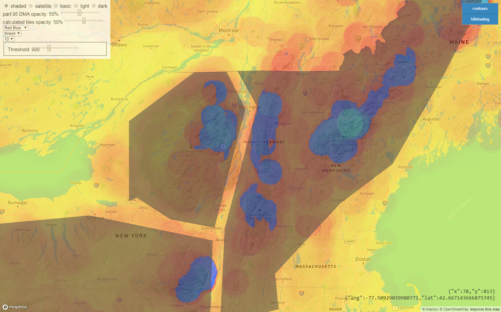
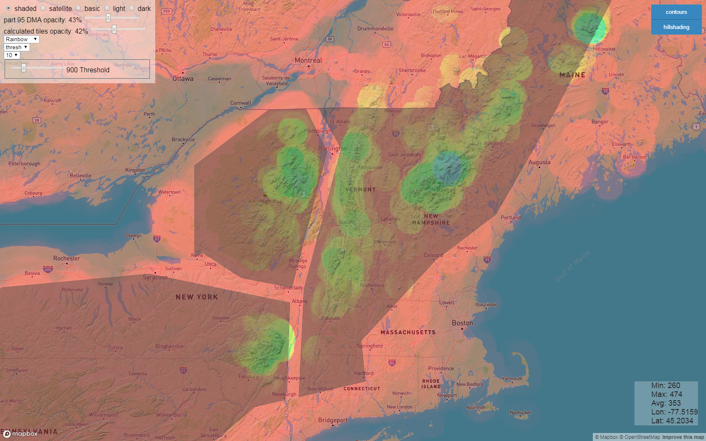
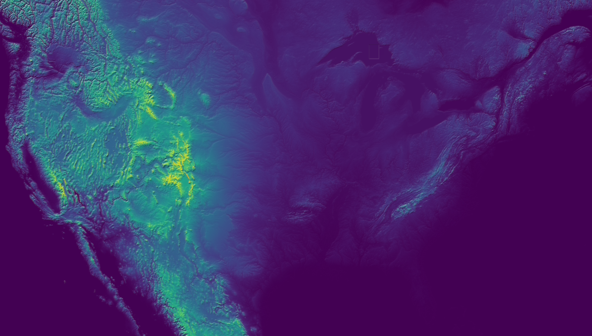
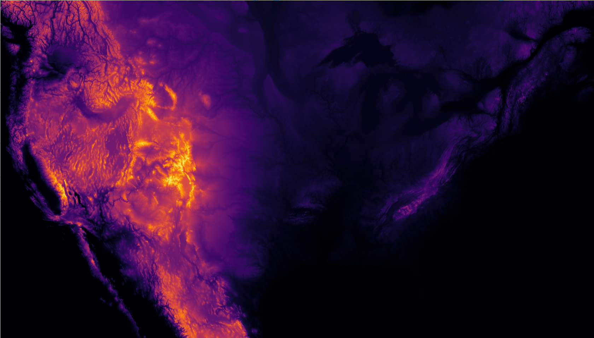

# DesignatedMountainousAreaTool
Interactive tool that allows the user to adjust the parameters used in determining Designated Mountainous Areas and visualize the result in various ways. Node.js is used for the serverside code, and the clientside code is just javascript using either the Leaflet.js or MapBox API, HTML, and CSS. Tiles are precomputed at 1 degree latitude by 1 degree longitude resolution using python and stored as JSON. This puts the data in a nonuniform grid, but it's based on the raw data source. The computation of the rasterized circle could be more efficient, but it got the job done. This tool can also make some nice digital art, although the resolution could be increased.

Designated Mountainous Areas (DMAs) were defined in the 1950's by just drawing simple bounding polygons on a map. The airspace in these areas have significantly different rules, and over the years, some exceptions have been made to omit areas from the original polygons, effectively designating them as non-mountainous.

Agreeing on a modern definition to what should be designated mountainous will likely take many years, but this tool allows you to change the definition and view the result. It's fairly quick to paint the entire contiguous United States (CONUS). It's easy to see that this needs to be rethought now that we have the capability.

This uses either the National Elevation Dataset (NED) or Digital Terrain Elevation Data as the original data.

How to use
----------
(only tested on windows 7 and windows 10 using either firefox or chrome browser)
1. Run terrSimpleSvr.bat at DesignatedMountainousTerrainTool\srv\code\terrSimpleSvr.bat  
&nbsp;&nbsp;&nbsp;&nbsp;&nbsp;* Server listening on port 8123 by default
2. Connect clients by going to [serverIP]:[port]/vis2.html for Leaflet.js version  
&nbsp;&nbsp;&nbsp;&nbsp;&nbsp; * OR connect clients by going to [serverIP]:[port]/vis.html for MapBox version (requires API access token)
